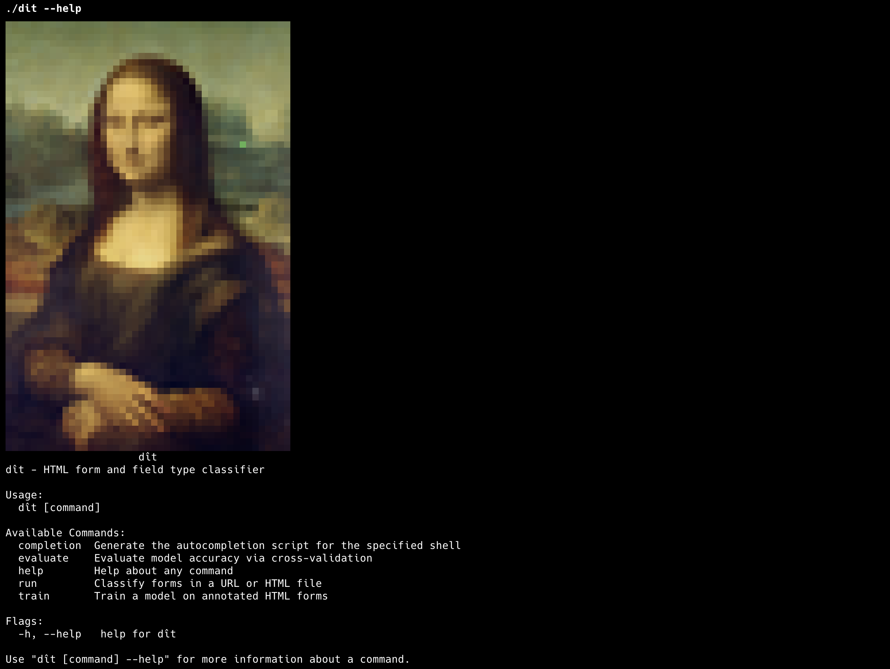

# dît



**dît** (means *found* in Kurdish) tells you the type of an HTML form and its fields using machine learning.

It detects whether a form is a login, search, registration, password recovery, contact, mailing list, order form, or something else, and classifies each field (username, password, email, search query, etc.). Zero external ML dependencies.

## Install

```bash
go get github.com/happyhackingspace/dit
```

## Usage

### As a Library

```go
import "github.com/happyhackingspace/dit"

// Load classifier (finds model.json automatically)
c, _ := dit.New()

// Classify forms in HTML
results, _ := c.ExtractForms(htmlString)
for _, r := range results {
    fmt.Println(r.Type)   // "login"
    fmt.Println(r.Fields) // {"username": "username or email", "password": "password"}
}

// With probabilities
results, _ := c.ExtractFormsProba(htmlString, 0.05)

// Train a new model
c, _ := dit.Train("data/", &dit.TrainConfig{Verbose: true})
c.Save("model.json")

// Evaluate via cross-validation
result, _ := dit.Evaluate("data/", &dit.EvalConfig{Folds: 10})
fmt.Printf("Form accuracy: %.1f%%\n", result.FormAccuracy*100)
```

### As a CLI

```bash
# Classify forms on a URL
dit run https://github.com/login

# Classify forms in a local file
dit run login.html

# With probabilities
dit run https://github.com/login --proba

# Train a model
dit train model.json --data-folder data

# Evaluate model accuracy
dit evaluate --data-folder data
```

## Form Types

| Type | Description |
|------|-------------|
| `login` | Login form |
| `search` | Search form |
| `registration` | Registration / signup form |
| `password/login recovery` | Password reset / recovery form |
| `contact/comment` | Contact or comment form |
| `join mailing list` | Newsletter / mailing list signup |
| `order/add to cart` | Order or add-to-cart form |
| `other` | Other form type |

## Field Types

| Category | Types |
|----------|-------|
| **Authentication** | username, password, password confirmation, email, email confirmation, username or email |
| **Names** | first name, last name, middle name, full name, organization name, gender |
| **Address** | country, city, state, address, postal code |
| **Contact** | phone, fax, url |
| **Search** | search query, search category |
| **Content** | comment text, comment title, about me text |
| **Buttons** | submit button, cancel button, reset button |
| **Verification** | captcha, honeypot, TOS confirmation, remember me checkbox, receive emails confirmation |
| **Security** | security question, security answer |
| **Time** | full date, day, month, year, timezone |
| **Product** | product quantity, sorting option, style select |
| **Other** | other number, other read-only, other |

Full list of 79 type codes in [`data/config.json`](data/config.json).

## Accuracy

Cross-validation results (10-fold, grouped by domain):

| Metric | Score |
|--------|-------|
| Form type accuracy | 83.1% (1138/1369) |
| Field type accuracy | 86.9% (4536/5218) |
| Sequence accuracy | 79.2% (1031/1302) |

Trained on 1000+ annotated web forms from Alexa Top 1M websites.

## Contributing

See [CONTRIBUTING.md](CONTRIBUTING.md).

## Credits

Go port of [Formasaurus](https://github.com/scrapinghub/Formasaurus).

## License

[MIT](LICENSE)
